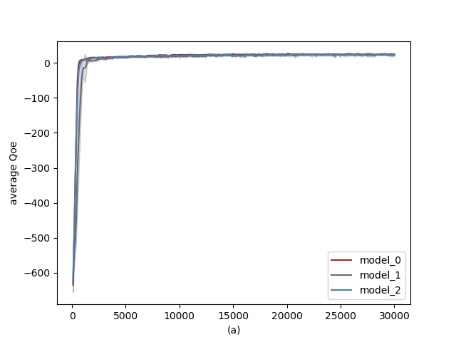
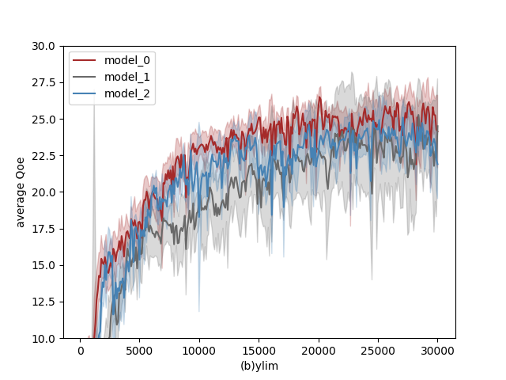

# Pensieve-pytorch
Implementing [pensieve](http://web.mit.edu/pensieve/) using pytorch.

The [author](https://github.com/hongzimao/pensieve) of pensieve uses tensorflow to implement it.

## Dependencise:

- python-2.7.15
- pytorch-1.0.1
- numpy-1.16.2

## Notes

When I used pytorch to implement it,I found a difference between the tensorflow implementation and the paper.

In ```hongzimao/pensieve/sim/a3c.py```,author used the mean square error of **R_batch** and **criticNetwork_output**(value function,in a3c.py line 243).But **R_batch** is the cumulative rewards in particular episode.In original paper,pensieve should use mean square of **r+\gamma * V(s_{t+1})** and **V(s_{t})** (paper,equation-3).

I have no idea how different between that,so I implemented 3 models to verify it:

- model 0 : only use pytorch to rewrite pensieve,no logical changes.use R_batch to update critic network.
- model 1 : according to equation-3,think of s_batch[:-1] as states,and s_batch[1:] as new states.(is that correct?)
- model 2 : no critic network,only actor network.

## Train

You can run an example:

        ```
        python pensieve_torch.py --model_type=1
        ```

## Results

 

Figure1:testing average QoE per 100 episodes.

I use testing-function to get average QoE per 100 episodes in training,and train 6 times using seed(42,142,242,342,442,542).

I found a phenomenon that even without critic network,I can get the similar results(see model_0 and model_2).

## Branches

- ppo : using PPO2 instead of A3C in ppo branch.
